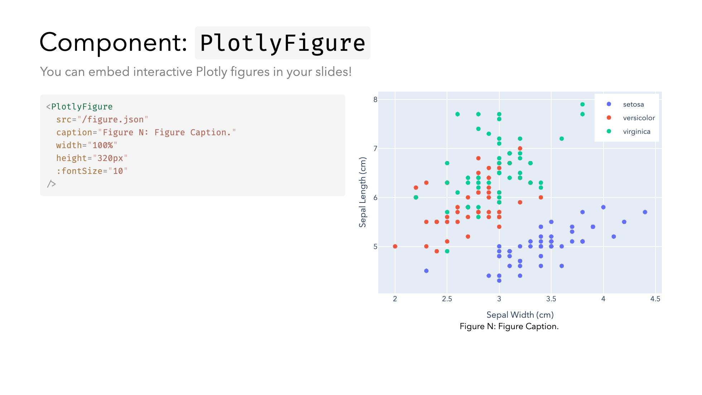

# slidev-addon-stem

A Slidev addon that provides components for embedding interactive Plotly figures and image figures with captions, along with a specialized layout for scientific and technical presentations.

## Demo



## Installation

```bash
pnpm install slidev-addon-stem
```

## Features

### PlotlyFigure Component

Embed interactive Plotly figures in your slides.

```markdown
<PlotlyFigure
  src="/path/to/figure.json"
  caption="Figure 1: Sample Figure"
  width="100%"
  height="320px"
  :fontSize="12"
/>
```

#### Properties

- `src`: Path to the Plotly figure JSON file (required)
- `caption`: Figure caption text (required)
- `width`: Figure width (optional, default: "100%")
- `height`: Figure height (optional, default: "100%")
- `fontSize`: Font size for the figure (optional, number)

### ImageFigure Component

Display images with captions.

```markdown
<ImageFigure
  src="/path/to/image.png"
  caption="Figure 2: Sample Image"
  width="100%"
  height="200px"
/>
```

#### Properties

- `src`: Path to the image file (required)
- `caption`: Image caption text (required)
- `width`: Image width (optional, default: "100%")
- `height`: Image height (optional, default: "100%")

### figure-side Layout

A pre-defined layout that creates a two-column structure with content on the left and a figure on the right.

```markdown
---
layout: figure-side
figureUrl: /path/to/figure.png
figureCaption: "Figure 3: Sample Caption"
---

::header::

# Title

Subtitle

::content::
Your content goes here.
```

#### Frontmatter Configuration

- `layout`: Set to "figure-side"
- `figureUrl`: Path to the figure
- `figureCaption`: Caption for the figure

## License

MIT License
